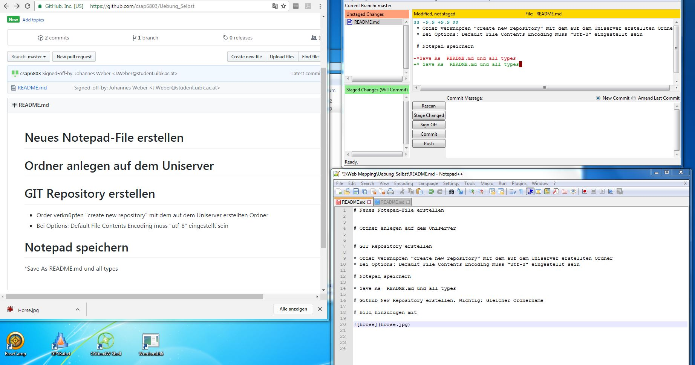

# Neues Notepad-File erstellen

# Ordner anlegen auf dem Uniserver 

# GIT Repository erstellen 

* Order verknüpfen "create new repository" mit dem auf dem Uniserver erstellten Ordner
* Bei Options: Default File Contents Encoding muss "utf-8" eingestellt sein

# Notepad speichern 

* Save As  README.md und all types 

# GitHub New Repository erstellen. Wichtig: Gleicher Ordnername

# Bild hinzufügen 

* Bild in Ordner speichern, wichtig Endung mit .jpg 
*  

 

